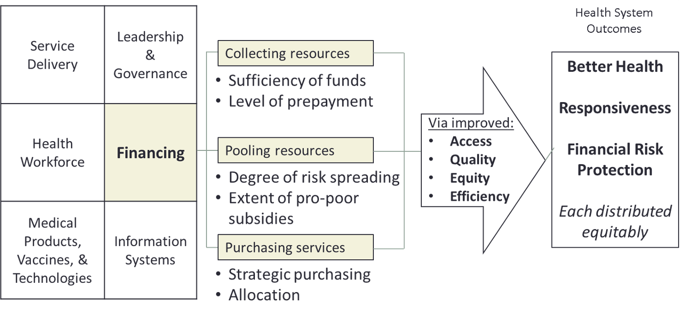
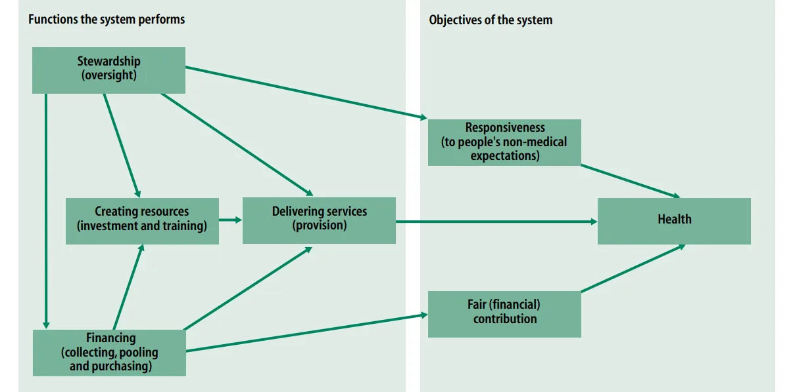
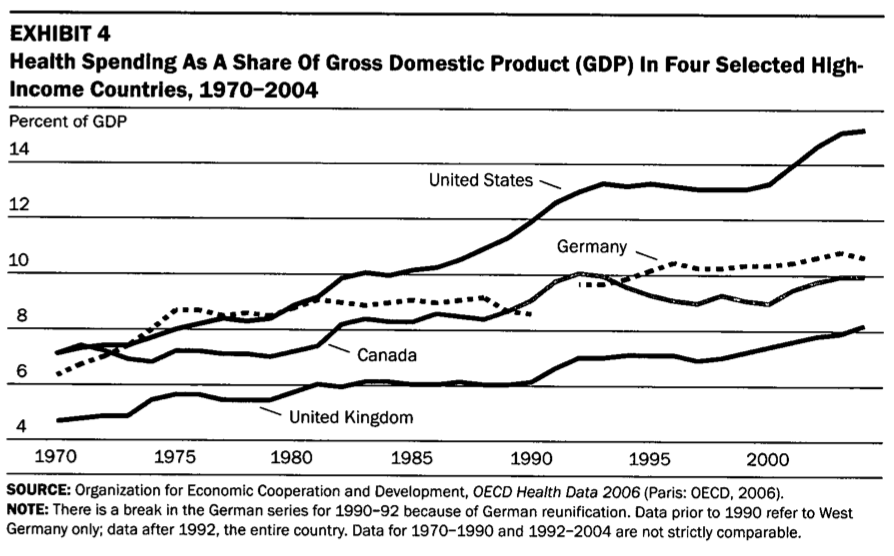
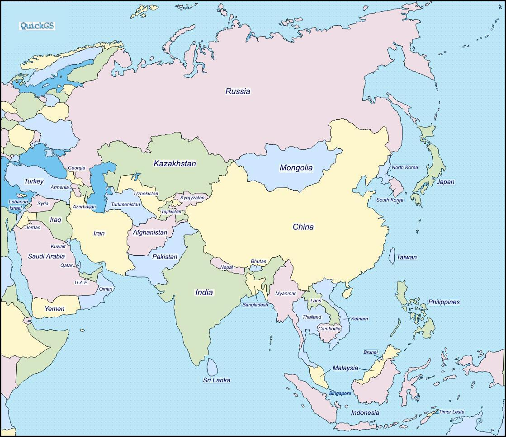
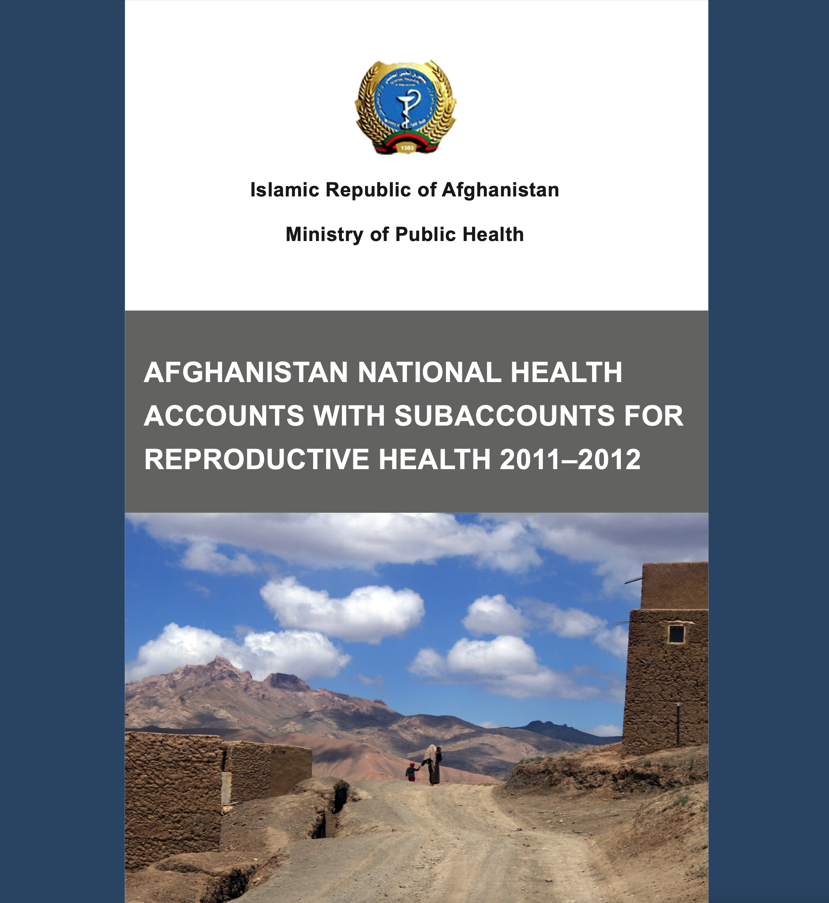

---
format:
  revealjs:
    theme: styles.scss
    transition: fade
    slide-number: true
    wide: true
    chalkboard: true
    margin: 0.1
    footer: "Georgetown University | Wu Zeng"
    controls: true
---

::: {.title-slide}

#  Health Systems Research from A Global Health Perspective

<br>
**Wu Zeng, MD, PHD**
<br>

Georgetown University

:::

---

```{r setup, include=FALSE}
knitr::opts_chunk$set(echo = TRUE, warning = FALSE, message = FALSE)
library(tidyverse)
library(kableExtra)
library(readxl)
```

## Outline 

- What is health system research?

- Why is health system research important?

- What are the key research questions in health system research?

- What are the methods used in health system research?

- Experiences in Afghanistan Health System Research ?

- key takeaway

---

## What is health system research 

:::: columns
:::{.column width="50%"}
- It remains a [new]{.red} area in global health 
- It dates back to [World Health Report 2000]{.red}, which defines health system as “all the activities whose primary purpose is to [promote]{.red}, [restore]{.red} or [maintain]{.red} health” (WHO, 2000)
- It is a [multidisciplinary]{.red} field that draws on [economics]{.red}, [sociology]{.red}, [political science]{.red}, and [public health]{.red} to understand how health systems function and how they can be improved
- However, there is [NO]{.red} universally accepted definition of health system research, and it can be difficult to define the scope of the field
:::
:::{.column width="50%"}


{.center width="120%"}
:::
::::

---

## Health System Framework

- The World Health Organization (WHO) has developed a framework for understanding health systems, which consists of six building blocks:

{.center}

---

## The role of health financing in health systems

- Health financing is a critical component of health systems, as it determines how resources are allocated and how services are delivered

    - It includes mechanisms for [raising funds]{.red}, [pooling resources]{.red}, and [purchasing services]{.red}

{.center}

---

## Alternative framework from WHO 2000 report

{.center}

---

## Why is health system, particularly health financing, research important?

:::: columns
:::{.column width="50%"}

- In 2010, WHO published a report on health system financing, which highlighted the importance of health financing research in improving health outcomes and achieving universal health coverage (UHC)

- In 2007, Prof. William Hsiao published a paper ^1^, calling for better understanding health systems to improve the performance of health systems and achieve UHC.
:::
:::{.column width="50%"}
{.center width="80%"}
:::
::::

^1^ Hsiao, W. C. (2007). Why is a systemic view of health financing necessary? Health Affairs, 26(4), 950-961.

---

## Some key research questions in health system research (examples)

- How can we design and implement effective health financing mechanisms to improve access to care and reduce financial barriers to care?

- How can we improve the efficiency and quality of health service delivery?

- How can we strengthen health information systems to improve decision-making and accountability?

- How can we improve the governance and leadership of health systems to ensure that they are responsive to the needs of the population?

- How can we improve the health workforce to ensure that there are enough trained health workers to meet the needs of the population?

- How can we improve the availability and affordability of essential medicines and technologies?

---

## Methods used in health system research

- Health system research uses a variety of methods, including:

    - [Quantitative]{.red} methods, such as surveys, administrative data analysis, and econometric modeling

    - [Qualitative]{.red} methods, such as interviews, focus groups, and case studies

    - [Mixed methods]{.red}, which combine quantitative and qualitative approaches to provide a more comprehensive understanding of health systems

- The choice of method depends on the research question being addressed and the context in which the research is being conducted

---

## Desciplines in health system research

- Health system research is a multidisciplinary field that draws on a variety of disciplines, including:

    - [Economics]{.red}, which focuses on the allocation of resources and the efficiency of health systems

    - [Sociology]{.red}, which focuses on the social determinants of health and the social dynamics of health systems

    - [Political science]{.red}, which focuses on the governance and leadership of health systems

    - [Public health]{.red}, which focuses on the population health outcomes of health systems

    - [Implementation science]{.red}, which focuses on the translation of research findings into practice

- The interdisciplinary nature of health system research allows for a more comprehensive understanding of health systems and the complex interactions between different components of health systems

---

## Experiences in [Afghanistan]{.red} Health System Research

- Afghanistan has a fragile health system that has been severely impacted by decades of conflict and instability

:::: columns
:::{.column width="50%"}

{.center}

:::

:::{.column width="50%"}

{.center width="65%"}

:::
::::

---

## General information and achievement in Afghansitan (2002-2023)

- General information about Afghanistan (2023)

    - Population: 41.5 million

    - GDP per capita: [$413]{.red}

    - Life expectancy: [66 years]{.red}

    - Economy has been stagnant before Taliban took over the country in 2021, droped during COVID-19 pandemic

- Achievements 

    - Life expectancy: [56]{.red} (2002) to [66]{.red} years (2023)
    - Infant mortality rate: from [104]{.red} (2002) to [50]{.red} (2023) per 1000 live births
    - Maternal mortality ratio: from [1,263]{.red} (2002) to [521]{.red} (2023) per 100,000 live births

---

## Current status and challenges in health financing in Afghanistan 

:::: columns
:::{.column width="50%"}

- Not sustainable, and not equitable (NHA 2021)

  - [Low]{.red} level of government spending (3.3%)

  - [Donor funding]{.red} anticipated to decline (19.5%)

  - [Substantial share]{.red} of out of pocket (OOP) spending (77.2%)

  - [Low execution]{.red} of existing government budget for health 

:::

:::{.column width="50%"}


:::
::::


---

## Generate evidence for advocacy and informing policy reform in the country

:::: columns
:::{.column width="60%"}

- [Tracking]{.red} health expenditure
    - National health accounts (NHA)
        - Donor survey; Household survey
        - Health facility survey
        - Imputation
    - Public Expenditure Tracing Survey
    - Expenditure management Information systems 

- [Costing and efficiency]{.red} analysis 

    - Costing of Essential Package of Health Services (EPHS) and Basic Package of Hospital Services (BPHS)
    - Costing of the Naitonal Health Strategy 2026-2020
    - Efficiency analysis of district hositals and health facilities 

:::
:::{.column width="40%"}



:::
::::

---

## Policy development to guide health reform implementation

:::: columns
:::{.column width="50%"}

- Health Financing Strategy
- Revenue Generation Strategy Framework
- Advocacy plan
- Policy briefs 

:::
:::{.column width="50%"}


:::
::::

--- 

## Health financing strategy in action (revenue generation and payment)

:::: columns
:::{.column width="50%"}
- Amended the [health law]{.red} in 2016
  - A turning point in public health history in Afghanistan
  - Paved the way for introducing broader health financing reforms
- [Tobacco tax]{.red} increased 
- Developed and passed the [user fee]{.red} regulation
- BPHS/EPHS to transition from contract management to [performance
management]{.red}
:::
:::{.column width="50%"}


:::
::::

---

## Health insurance exploration in Afghanistan

- Afghanistan [does not]{.red} have a insurance scheme 

- The Government wanted to conduct a [feasibility]{.red} studies of establish health insurance schemes 

- But 

<center> 

### How?

</center>

---

## If you are tasked to conduct a health insurance feasibility study, how would you propose to do it?

:::: columns
:::{.column width="50%}

- [Political]{.red} perspective
- [Operational]{.red} perspective


:::
:::{.column width="50%"}

- [Technical]{.red} perspective
  - Premium (what should be consider?)
  - Benefit package design (what should be consider?)
  - Service delivery and contracting (what should be consider?)

:::
::::

---

## Implementation of health insurance feasibility study in Afghanistan

:::: columns
:::{.column width="50%"}

- First phase (2014-2015)
    - Stakeholder analysis (Qualitative)
    - Legal assessment
- Second Phase (2018-2020)
    - [Willingness and ability]{.red} to pay for health insurance
    - [Benefit package design]{.red} for health insurance
    - [Actuary analysis]{.red} for health insurance
:::
:::{.column width="50%"}


:::
::::

---

## Actuarial analysis framework 

<center>


</center>

---

## Cost recovery rates from the actuarial analysis

```{r echo=F}
readxl::read_excel("HF-findings.xlsx", sheet = "Sheet1", range = "A11:H18") %>%
kable(longtable = T, booktabs = T, align = "lrrrrrrr")  %>%
  kable_classic(full_width = T) %>%
   row_spec(0, bold = T, color = "darkred") %>%
    column_spec(1, width = "8cm") %>%
    kable_styling(font_size = 18)
```

---

## What is happening in Afghanistan now?

- Health system in Afghanistan is on the brik of collapse
  - NGOs moved out of the country
  - Shortage of medicines and medical supplies 
  - Many staff and medical doctors left
- Donors cannot provide direct support to the government, and have to channel their support through NGOs, which is not sustainable

---

## Key constraints in global health 

- Funding reduced significantly, and the future of funding is uncertain
    - Bilateral aid: 20% decline compared to 2023
    - Multilateral shortfalls: Major institutions like WHO and Global Fund facing significant funding gaps. (e.g., WHO has scaled down its global staff by 25%)
- Overall global instability, which makes it difficult to generate revenue and implement health reforms in many countries
    - Russia-Ukraine war
    - Gaza-Israel war
    - US-Iran tension
- Multilaternalism is under threat

---

## Future of global health aid 

:::: columns
:::{.column width="50%"}
- More domestric resources mobilization from LMICs 
- Bilateral support reset
    - US signed $20.2 billion bilateral agreement with 27 countries as of March 2026
    - US shifted from “aid to trade” to partnerships grounded in mutual economic and security interests
- Tiered contributions
- Mixed development and humanitarian donors 
- Implementation science remain critical to translate research findings into practice
:::
:::{.column width="50%"}
{.center width="100%"}
:::
::::

---

## Key takeaway

- Health system research is [underdeveloped]{.red} but critical to improving health outcomes and achieving UHC
- Health system research is a [multidisciplinary]{.red} field that draws on a variety of disciplines to understand how health systems function and how they can be improved
- Health system research is witnessing substantial [changes]{.red} in the context of global health
- China has a lot to offer in terms of health system research, and there are many opportunities for collaboration between China and other countries in this field

---

## Comments are welcome

<br>

<br> 

<center>

Contact information: 

Wu Zeng

Email: wz192@georgetown.edu

</center>